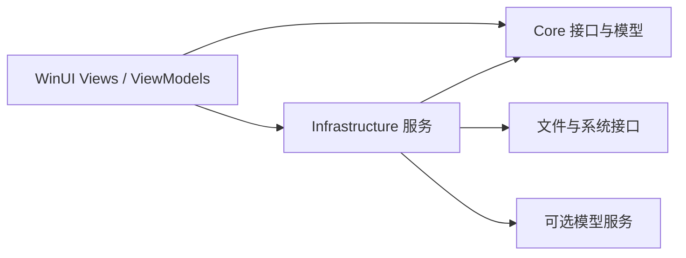

<div align="center">


# 软迹 · Ruanji

整理已安装软件、查看文件，把迁移与管理操作放进一个桌面工作台。

[](https://github.com/alanbulan/ruanji/releases)


[功能特性](#功能特性) · [快速开始](#快速开始) · [工程结构](#工程结构) · [构建与操作验证](./BUILD_AND_SAFETY.md)

</div>

软迹是使用 C#、WinUI 3 与 .NET 构建的 Windows 软件管理项目。界面采用 MVVM，核心模型、服务实现和桌面展示分层组织。迁移、卸载和清理可能修改真实文件与系统状态，使用前应做好备份并先验证可丢弃样例。

## 功能特性

| 软件管理 | 文件与迁移 | 可选 AI 能力 |
| --- | --- | --- |
| 扫描、搜索与分类 | 文件浏览、类型统计与空间分析 | 多会话对话与模型配置 |
| 版本、大小与安装路径 | 迁移目标、命名和链接设置 | 文件分析及工具调用界面 |
| 目录入口与管理操作 | 残留、临时文件和注册表相关操作 | 兼容接口的模型列表读取 |

上表整理既有项目功能说明，不构成本轮运行验收。模型配置成功不等于文件分析可靠，软件迁移完成提示也应结合文件清单和原应用启动验证。

## 快速开始

从 [Releases](https://github.com/alanbulan/ruanji/releases) 查看实际存在的构件与说明；不把 README 中的历史手写版本号当作最新版。

源码构建使用 Windows、.NET 8 SDK 和适配 WinUI 的开发工具链：

```powershell
git clone https://github.com/alanbulan/ruanji.git
cd ruanji
dotnet build .\src\WindowsSoftwareOrganizer\WindowsSoftwareOrganizer.csproj -p:Platform=x64
```

以实际构建输出位置运行应用，不假设不同发布配置都会使用同一个 EXE 路径。发布前检查所选平台的发布配置，具体见 [BUILD_AND_SAFETY.md](./BUILD_AND_SAFETY.md)。

### 安装要求的准确含义

主 csproj 的编译目标为 `net8.0-windows10.0.19041.0`，最低平台声明为 `10.0.17763.0`；这两个值不是同一个概念，也不等于每个系统版本都完成了实机测试。原文“1903 (19041)”的混合描述不再使用。

项目声明 x86、x64 和 ARM64，但具体可用安装包以发布资产为准。Windows App SDK 自包含设置与 .NET 运行时是否随包分发也需要分别核对。

## 工程结构



| 入口 | 职责 |
| --- | --- |
| [主应用](./src/WindowsSoftwareOrganizer) | WinUI 页面、视图模型与资源 |
| [Core](./src/WindowsSoftwareOrganizer.Core) | 模型与接口 |
| [Infrastructure](./src/WindowsSoftwareOrganizer.Infrastructure) | 文件、软件及外部服务实现 |
| [tests](./tests) | 现有测试工程 |
| [CHANGELOG.md](./CHANGELOG.md) | 项目变更记录 |

## 使用与验证

首次使用只扫描并核对信息，不直接对系统目录批量清理。迁移需检查源/目标、同名文件、权限、链接、取消与恢复；涉及注册表或卸载应单独确认操作范围。AI 服务使用脱敏样例，不把私人文件内容发送给未经确认的供应商。

构建、单元测试、桌面交互和真实迁移是四类不同验证；测试应使用临时目录，不能为了覆盖功能而卸载真实应用。详细的验证表和环境依据见 [构建与操作验证](./BUILD_AND_SAFETY.md)。

本次静态核对了原 README 和主项目文件，仅修改文档；未运行 Windows 应用、更新依赖、编译安装包或操作用户磁盘。

## 来源与贡献

保留现有 [LICENSE](./LICENSE) 和项目署名，不因文档改版重新授权。问题反馈和贡献使用本仓库 Issues/PR，提交脱敏的复现步骤、目标平台与相关日志即可。
